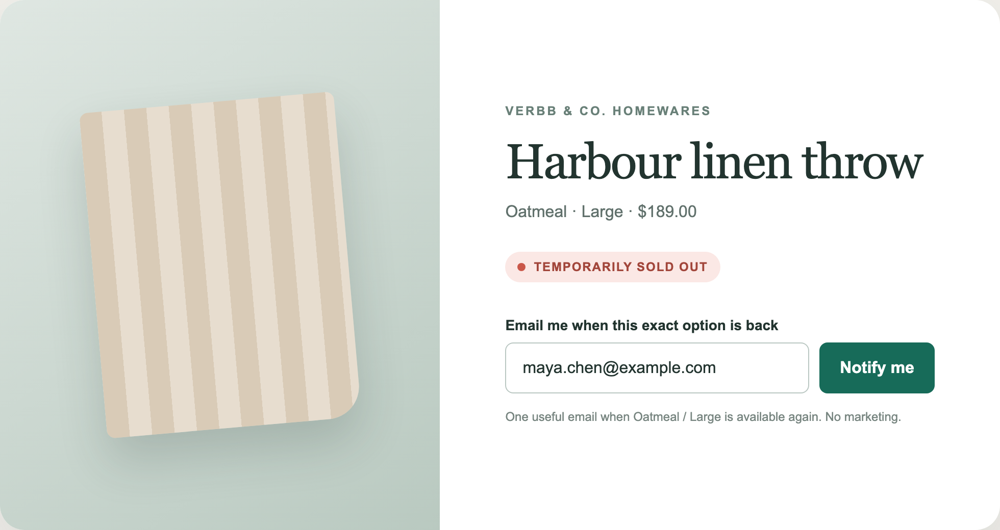
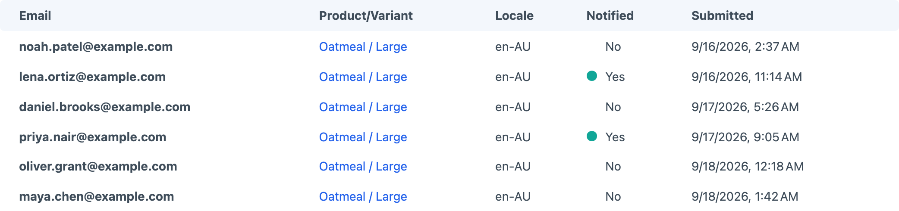
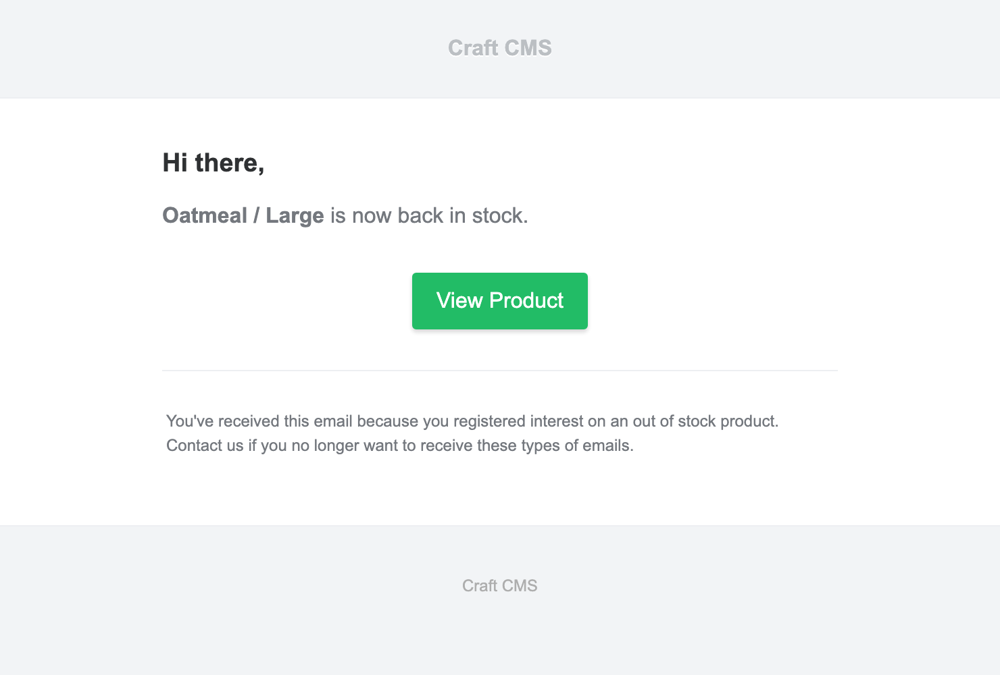

<!-- feature-intro -->
Back in Stock turns sold-out Craft Commerce variants into a reason for customers to return. Collect interest at the product, notify the right people when inventory recovers, and keep the message on brand.
<!-- feature-intro-end -->

<!-- feature-section media-size="large" -->
## Capture demand

Add a notification form to a product page and subscribe guests or signed-in customers to the exact variant they want. Requests remain visible in Craft, giving the team a clear view of demand while the item is unavailable, and completed requests can be purged automatically when the privacy policy calls for it.

<!-- feature-section-end -->

<!-- feature-section media-size="large" -->
## See every request

Review the email address, requested variant, locale, notification state and submission date in one current Craft control-panel view. That makes demand visible before stock returns and keeps the customer journey easy to audit afterwards.

<!-- feature-section-end -->

<!-- feature-section media-size="medium" -->
## Restock notifications

Choose the stock threshold that counts as available and let Craft’s queue deliver notifications when a subscribed variant crosses it. Custom subjects and Twig templates keep confirmation and availability emails consistent with your store.

<!-- feature-section-end -->
